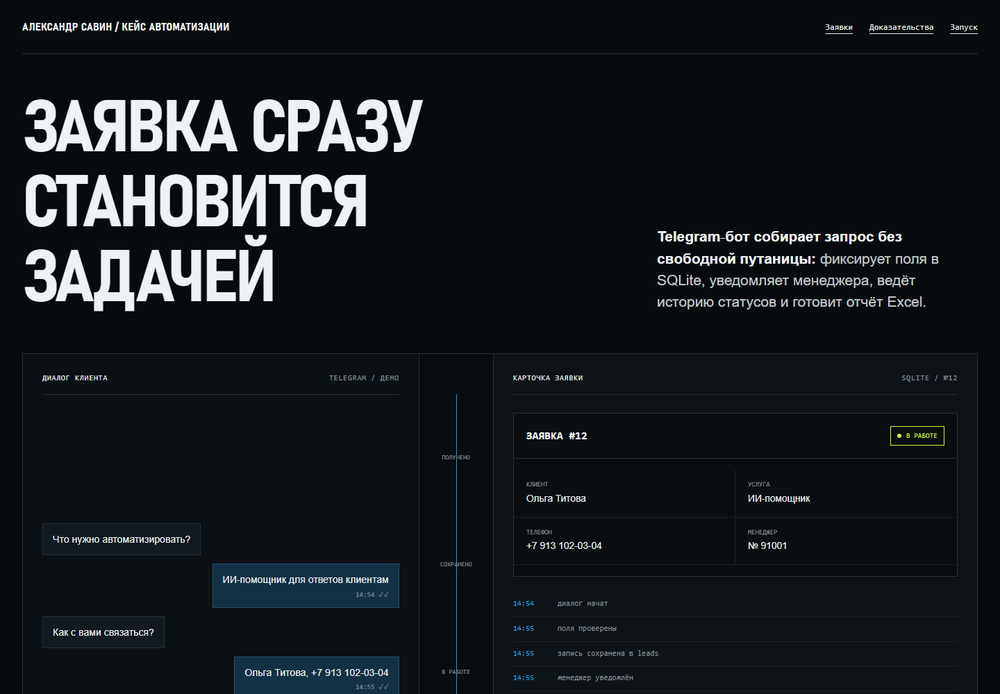

# Telegram CRM Bot

Портфолио-проект Александра Савина для позиции Junior Python / Automation Developer. Бот принимает заявку, сохраняет её в SQLite, уведомляет менеджера, ведёт историю статусов и экспортирует очередь в Excel.

**[Открыть интерактивный HTML‑кейс](https://alextander28.github.io/telegram-crm-bot/)**



Все демонстрационные клиенты и обращения синтетические. Проект не отправляет реальные сообщения при запуске тестов или локального демо.

## Что доказано

- клиентский FSM-сценарий: имя → телефон → услуга → комментарий → удобное время → подтверждение;
- проверка российского телефона без молчаливого исправления неоднозначных значений;
- SQLite-реестр и отдельная история статусов;
- действия менеджера: `Взять в работу`, `Отложить`, `Закрыть`;
- команды `/leads`, `/stats`, `/export` только для разрешённых Telegram ID;
- Excel с листами `Заявки`, `История`, `Сводка`;
- автономная демонстрация без токена и сети.

## Быстрый локальный запуск демо

```powershell
python -m venv .venv
.\.venv\Scripts\python.exe -m pip install -r requirements.txt
.\.venv\Scripts\python.exe -m app.demo --reset
```

Результаты появятся в `data/crm.sqlite3`, `data/sample_leads.csv`, `reports/leads.xlsx` и `reports/summary.json`.

## Тесты

```powershell
.\.venv\Scripts\python.exe -m pytest -q
```

Тесты используют временную базу и не обращаются к Telegram API.

## Подключение Telegram

1. Создайте бота через BotFather и получите токен.
2. Скопируйте `.env.example` в `.env`.
3. Заполните `BOT_TOKEN`, `MANAGER_CHAT_ID` и `MANAGER_IDS`.
4. Запустите:

```powershell
.\.venv\Scripts\python.exe -m app.bot
```

Токен нельзя добавлять в Git, HTML, скриншоты или сообщения. `.env` уже исключён через `.gitignore`.

## Структура

- `app/models.py` — доменные модели и статусы;
- `app/database.py` — схема и подключение SQLite;
- `app/services/lead_service.py` — публичная бизнес-логика;
- `app/services/export_service.py` — Excel-выгрузка;
- `app/handlers/` — тонкие aiogram-сценарии;
- `app/demo.py` — воспроизводимые синтетические артефакты;
- `index.html` и `case-study.html` — автономный кейс для работодателя;
- `spec.md` — границы и критерии приёмки.

## Границы MVP

В первую версию не входят веб-CRM, PostgreSQL, Docker, Google Sheets, платежи, hosting/webhook и автоматическое закрытие заявок. Реальную отправку можно проверить только после локального добавления пользовательского токена и ID; она не заявляется как выполненная в поставке.
